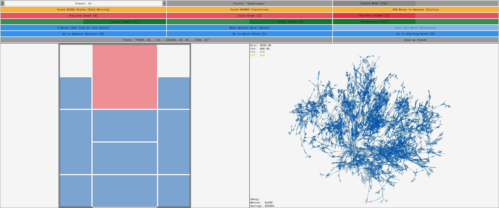

# MassSprings - Puzzle Board State Space Explorer

All combinations of pieces reachable from an initial puzzle are explored, the resulting puzzle state-space is visualized as a force-directed graph.
The graph layout is calculated iteratively using a mass-spring-system with additional pairwise repulsive forces simulated using Barnes-Hut.

Build and run on NixOS: `nix run git+https://gitea.local.chriphost.de/christoph/cpp-masssprings`.